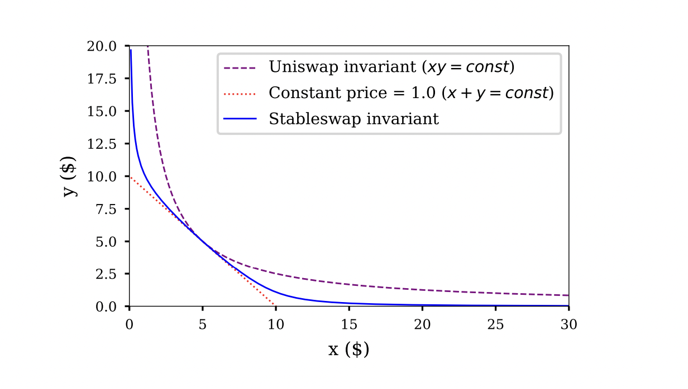

tags: DocPaper

---

This document is mostly a destined to show the different options of how documents can be created. Before we have a look at the document so far we briefly want to mention how documents are created: key to this is `Convert.py` in the `code` directory, or `Convert.ipynb`. Those two files are equivalent and kept in synch by JupyText. Note that whilst `Convert.py` can be run in a Python interpreter it will fail if not run in a proper Jupyter environment as we are using the bang-execution framework, eg `!pandoc` to execute pandoc.

Up to here we have already seen the following features

- documents are assembled according to their tags; eg `tags: DocPaper` unites all the documents that are part of DocPaper; the files are assembled in lexical order, hence the prefix `000` or `t000`; a file
with `tags: DocPaper, OtherPaper` would be part of both papers

- the document-wide metadata (in `000`) that in particular sets key frontmatter items like `title`, `subtitle`, `abstract`, `author(s)`, `date` and `version`; it also contains key LaTeX items under the `latex` key (see below)

- a custom title page (in `010`), to be used for non-tex documents only (`notex: true`); it is a template (`istemplate: true`) which means that eg `{title}` will be replaced with the document title; tex documents

- two structure pages (in `100`, `101`), here specifically a section break (`type: section`) and a chapter break (`type: chapter`); a page break is included before (`breakbefore: 1`; this may or may not work in LaTeX) 

The aforementioned items under the `latex` key are as follows:

- `template`: which template to use (the templates are in `code/templates`)
- `fontsizea`:   eg `11pt`
- `geometry`:   eg `a4paper`
- `stretch`:    eg `1.5` for line spacing

<!--WT=PAGEBREAK-->

The first feature we see in this paper the `WordTag` feature where we include raw XML into the markdown that pandoc in term preserves in the generated Word documents (it ignores it when producing LaTeX). Wordtags are included with the following syntax

    <!--WT=[ITEM]-->

where ITEM can be any of

- `PAGEBREAK`
- `SECTIONBREAK`

Other tags are planned, but have not been introduced yet. The code for this is in `wordtags.py`.

We can also include equations into the markdown, that pandoc then properly converts to Word (or to LaTeX, but this is trivial). Equations can be included literally, eg like here

$$
E = mc^2
$$

We are also providing a module (in `formulalib.py`) that allows to include formulas generated in Python via Sympy, typically in a Jupyter notebook (or in multiple Jupyter notebooks) that can be reused across multiple documents. Below is an example for an included equation

$$=PythagorasE=$$

We can also include images using the markdown `` construct. In Word, those images will appear exactly where they have been placed. In LaTeX, they will float and the text in `[.]` will be the figure caption that can be used to refer to them in the text.

In Word this text is after the image. In LaTeX, it will have the caption "Example Image", but to where it will float is rather uncertain. Note that images will have to be in the `src/_img` (which means they'll show up in VSCode linked preview) and Convert will copy them to `out/_img`. ATTENTION: `out/_img` will be cleaned up before every run. Do not store images there.
